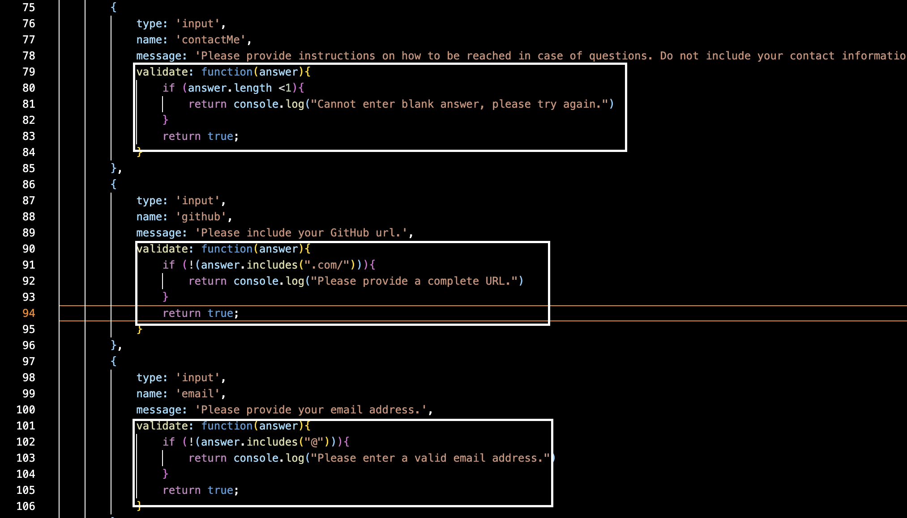
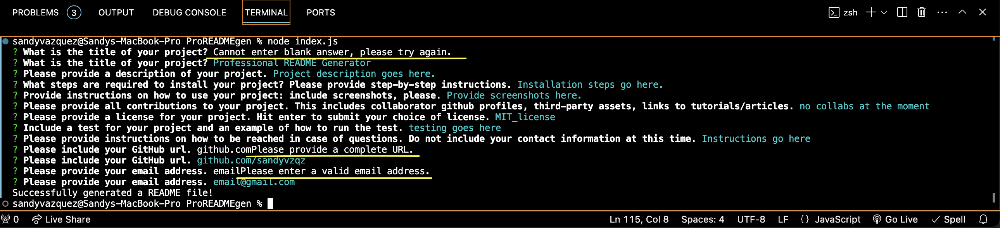

#Professional README Generator README file
-[License Badge][Github license](https://img.shields.io/badge/license-MIT_license-blue)

##[Description]
The purpose of this project is to generate a professional README.md file dynamically using node.js from the terminal. This is achieved using two npm library packages (inquirer, and fs). The inquirer library is used to prompt the user for input that will be contained inside the READEME.md file. The file-system library is used to write the user input into the README file.
---
##[Table Of Contents]
-[Description](#description)
-[Installation](#installation)
-[Usage](#usage)
-[Contribution](#contribution)
-[Testing](#testing)
-[Contact Me](#contactMe)
-[License](#license)
---

##[Installation]
The first step to install this generator is to use 'git clone' to clone the repository. The next step is to run 'npm install' in the terminal. This command automatically installs all required npm library packages from the package.json file. The last step is to run the command 'node index.js' in the terminal, and then answer all the prompted questions. 
Your new README.md file will be generated upon prompt completion.

##[Usage]
This is a short walk-through video showing how to use this README generator from the terminal in VS Code editor. 
[Video demo](./video/DemoVideo.mp4)

##[Contribution]
The following webpages were referenced to help implement the code that created this project. 
-[npm inquirer](https://www.npmjs.com/package/inquirer#installion)
-[Readme document format](https://coding-bootcamp.github.io/full-stack/github/professional-readme-guide)
-[Markdown cheat sheet](https://www.markdownguide.org/cheat-sheet/)
-[Shields.io](https://shields.io/badges/static-badge)
-[Coding licenses](https://choosealicense.com/licenses/)

##[Testing]
To test code, I simply inserted validate functions inside of each prompt question. These validate functions help filter unwanted answers from prompt questions. To test these, I simply entered blank or incomplete answers, and checked for the error message. 
 

##[Contact Me]
If you have any questions regarding this project, please contact me via email. I will reach out to you as soon as possible.
My GitHub project repository is github.com/sandyvzqz.
My current email address is ssolivares0@gmail.com.

##[License]
If you want to learn more about the license rights, please click this link https://mit-license.org/.
